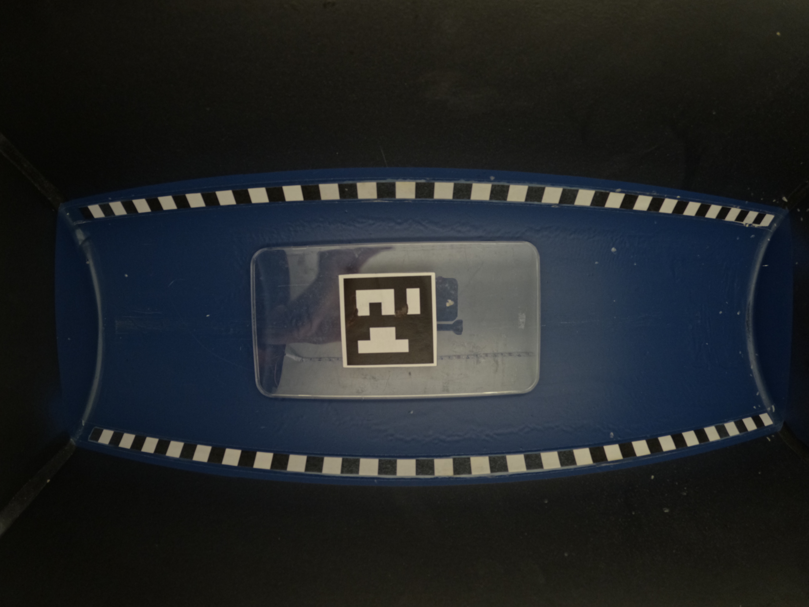

# Fish_species_detection

Repo for fish species detection project at Aalborg University

## Methods used

1.
    A dataset of 310 sea creatures including 34 different species where made using a custom made photobox.
    - For each sea creature the dataset contains:
        - The lenght of the sea creature
        - The species of the sea creature
        - Two images from different sides of the sea creature

2.
    Pytorch is used along with a pre-trained model (VGG16 - <https://pytorch.org/vision/main/models/generated/torchvision.models.vgg16.html>). The model pre-trained model containing weights that has been obtained by training it using the IMAGENET1K_V1 dataset. The output of the pre-trained model is given to a classifier that is trained on the data set created in this project. The final model is thereby a pre-trained model combined with a classifier. The input to the model is the .png image taken directly with a GoPro camera. The output of the final model is the k-most probable species.

    More on the model and the general structure of the model and how it is used: <https://www.youtube.com/watch?v=zFA8Cm13Xmk&t=513s>
    **NOTE: Some hyperparamtres have been changed and also some of the structure of the code.**

    As of 03/07/2022, The classifier have only been trained on two classes i.e. "cod" and "other"

3.
    A calibration session is done where a checker board is used for calibration <https://github.com/opencv/opencv/blob/4.x/doc/pattern.png>

    The camera intrinsics and distortion coefficients are obtained in this session and saved.

4.
    The camera intrinsics and distortion coefficients are loaded and used to undistort the images of cods.

5.
    An ArUco marker is printed and mounted on a flat board and put into the fish box: 

    This image is used with cv2 functions to find the circumference of the ArUco markers in pixels. The circumference is then measured with physically in mm. By deviding the circumference in pixel with the circumference in mm gives a mm/pixel ratio

6.
    The fish is segmented using hue thresholding. A bounding box is created around the fish. The lenght of the fish is found by taking the mm/pixel ratio and applying to the lenght of the bounding box. This gives the lenght of the fish.

7.
    A sample of 95 cods is taken. The lenght estimation method is used and comparred with the lenght that were measured physically when the dataset was created. This gives the following results:

    - <https://aaudk.sharepoint.com/:i:/r/sites/Fiskeprojekt/Delte%20dokumenter/General/Figure/Real_vs_estimated.png?csf=1&web=1&e=4lzsQk>

    - <https://aaudk.sharepoint.com/sites/Fiskeprojekt/Delte%20dokumenter/General/Figure/Error_at_different_lenghts.png?csf=1&web=1&e=ww5OMj&cid=a4625146-1a0b-4337-8ccb-2e87acecb9c1>

    There is korrelation between the measured and estimated data. Therefore the mean of the errors of the sample is subrated from the estimated lenght. This gives the following results:

    - <https://aaudk.sharepoint.com/:i:/r/sites/Fiskeprojekt/Delte%20dokumenter/General/Figure/Error_at_different_lenghts_avg_subtracted.png?csf=1&web=1&e=CuWQ6k>

    - <https://aaudk.sharepoint.com/:i:/r/sites/Fiskeprojekt/Delte%20dokumenter/General/Figure/Real_vs_estimated_avg_subtracted.png?csf=1&web=1&e=LOvK0w>

8.
    A stratified k-fold cross-validation is done as described here: <https://en.wikipedia.org/wiki/Cross-validation_(statistics)#:~:text=out%20cross%2Dvalidation.-,k%2Dfold%20cross%2Dvalidation,-%5Bedit%5D>

## Perquisites

- This is developed for windows and only tested on Window 11 OS

## Setup

1. Download the repository:

    ``` bash
    https://github.com/kasperfg16/fish_species_detection.git
    ```

2. Install conda

    ``` bash
    start /B /WAIT %UserProfile%\miniconda.exe /InstallationType=JustMe /AddToPath=0 /RegisterPython=0 /S /D=%UserProfile%\miniconda3
    ```

3. Open command prompt

    - a)

        Navigate to the repository folder (...**\fish_species_detection**)

        Example:

        ``` bash
        cd C:\Users\Kaspe\OneDrive\Onenote\GitHub\fish_species_detection
        ```

    - b)

        Create a conda environment

        ``` bash
        conda create -n env_pytorch python=3.10.4
        ```

    - c)

        Activate the environment:

        ``` bash
        conda activate env_pytorch
        ```

        Install required packages:

        ``` bash
        pip install -r requirements.txt
        ```

    Now you're ready to run the code

## How to use

Go through **Setup**

1. ### Train the model

    To train the model put images into [fish_pics\input_images](fish_pics\input_images)

    To add another class, create a new folder inside [fish_pics\input_images](fish_pics\input_images) and upload images of this new class into this folder. E.g **fish_pics\input_images\tortiose**

    Then run [train.py](train.py)

    To stop the training press ctrl+c **ONCE**. This will stop the training at the point where it is and save the model.

2. ### K-fold validation

    Run [train_k_fold_val.py](train_k_fold_val.py)

    NOTE: The number of k's is set to default of 5. To change this run:

    ``` bash
    Run python train_k_fold_val.py --num_of_k = <number of k that you want>
    ```

    ``` bash
    Run python train_k_fold_val.py --epocs = <number of epocs that you want>
    ```

    To see the rest of the arguments run:

    ``` bash
    Run python train_k_fold_val.py help
    ```

3. ### To run main code

    Run [main.py](main.py)

## Train your own classifier on your own dataset with google colab

Follow the link and follow the instructions

<https://colab.research.google.com/drive/1qksJvIxpnAULe_8XfI04jG13a-3klOKA?usp=sharing>

## Inspiration used to create this project

1. loading of images:

    <https://ryanwingate.com/intro-to-machine-learning/deep-learning-with-pytorch/loading-image-data-into-pytorch/>

2. <https://docs.microsoft.com/en-us/learn/modules/intro-computer-vision-pytorch/2-image-data>

3. Using a pretrained model to perform image classification

    <https://github.com/LeanManager/PyTorch_Image_Classifier/blob/master/train.py>

    Youtube video: <https://www.youtube.com/watch?v=zFA8Cm13Xmk&t=513s>
